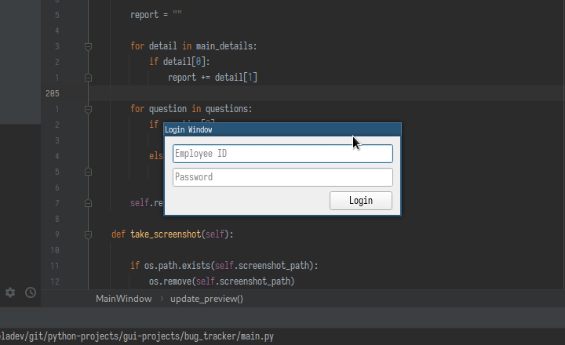

# Bug Tracker Application

## Completed
##### Security
- [x] Employee login with ID number and password
- [x] Popup login window instead of in-tab technician login
##### Networking/Upload/Download
- [x] Connect with MongoDB
- [x] Technician login verification
##### Compatibility
- [x] Available on Windows/Mac/Linux
##### Functionality
- [x] Checkboxes to mark what information to send (with defaults)
- [x] Questionaire with urgency level
- [x] Generate and attach a screenshot
- [x] Text boxes to optionally write in more details
- [x] Preview of bug report with all selected information shown

## TODO
##### Security
- [ ] Secure Login Authentication through MongoDB
##### Networking/Upload/Download
- [ ] Zipped report automatic upload to FTP
##### Compatibility
- [ ] Create executables/packages for each OS
##### Functionality
- [ ] New/old/fixed statuses
- [ ] Sorting by time reported, severity, issue type, questionaire
